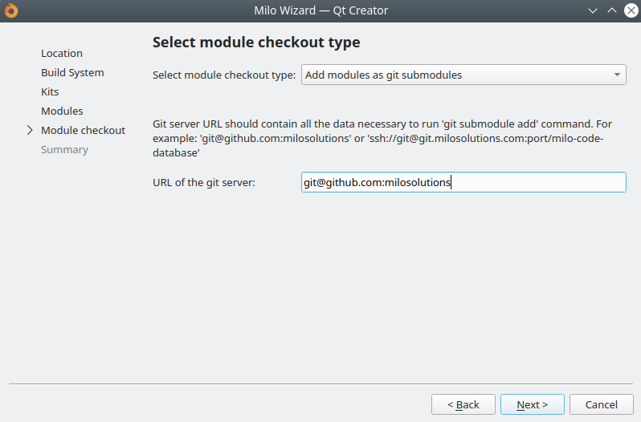

Milo QtCreator wizard
===

Source code: [GitHub](https://github.com/milosolutions)

\tableofcontents

# Intro

Milo Code Database is the place where we keep all useful pieces of code:
snippets, working modules, templates. The repository is organised into a Qt
Installer Framework project. MCDB is a great way to skip all the mundane and
boring code you have to write for each new project - here you get all the
initial project code prepared and ready for further development.

If you need some mobule for an existing project, see
[subprojects](doc/subprojects.md). That page also contains links to online
documentation.

If you are creating a new project, you are encouraged to check our MCDB
installers. See the following sections for more details.

# Subprojects

Here is a list of subprojects (for github links click [here](doc/subprojects.md))
1. [New project template](https://docs.milosolutions.com/milo-code-db/mwizardtemplate) - template for all new Qt projects (QML and Widgets).
Contains a scaffolding for Qt app with documentation, tests, resources etc.
2. [MScripts](https://docs.milosolutions.com/milo-code-db/mscripts) - scripts for integration with GitLab CI, Mattermost, versioning
scripts for all platforms (including git SHA), and more
3. [MConfig](https://docs.milosolutions.com/milo-code-db/mconfig) - a small class which helps storing user app settings and configuration
4. [MLog](https://docs.milosolutions.com/milo-code-db/mlog) - small but powerful log class, with full categorized logging support
5. [MRestAPI](https://docs.milosolutions.com/milo-code-db/mrestapi) - handy set of base classes for talking with REST web servers
6. [MBarcodeScanner](https://docs.milosolutions.com/milo-code-db/mbarcodescanner) - small helper class that allows to scan barcodes and QR codes
using QZXing library
7. [MCharts](https://docs.milosolutions.com/milo-code-db/mcharts) - implements some simple yet meaningful and eye friendly charts to display data
8. [MSentry](https://docs.milosolutions.com/milo-code-db/msentry) - remote logger support (Sentry/ Raven). Easy to turn on and off, just with a config switch
9. [MCrypto](https://docs.milosolutions.com/milo-code-db/mcrypto) - AES module, containing simple and convenient API, based on OpenSSL and it has a fallback if OSSL is not available
10. [MSshTunnel](https://docs.milosolutions.com/milo-code-db/msshtunnel) - wraps ssh port forwarding functionality (a.k.a. SSH tunneling) with convinient class.
11. [MCalendar](https://docs.milosolutions.com/milo-code-db/mcalendar) - provides calendar widget
12. [MEmailSystem](https://docs.milosolutions.com/milo-code-db/memailsystem) - provides basic e-mail functionality.
13. [MDatabase](https://docs.milosolutions.com/milo-code-db/mdatabase) - provides database support and migrations functionality.

Instructions on how to add a new module are contained in [repositoryguide](doc/repositoryguide.md).

# QtCreator Wizard

You can find prebuilt installers of Milo QtCreator Wizard on our
[Seafile](https://seafile.milosolutions.com/d/2c50614e1e/).

The wizard is the quickest way to create a new project: with all
necessary boilerplate code in place. The .pro file, CMakeLists.txt, doxygen,
logger, build helpers, CI scripts, config classes... everything you choose
to include (the process is customizable) will be extracted to a single
place - all that is left for you is start coding the interesting bits!

# Using MCDB

Milo Code DB can be used in 2 main ways:

1. Use the Milo QtCreator Wizard to set up a new project. Add any modules
you will need.
2. Use MCDB modules in an existing project: either by copying the code or
adding them as git submodules.

Each MCDB submodule contains a readme file and doxygen documentation, so refer
to them for more info. All docs are also available
[online](https://docs.milosolutions.com/milo-code-db/milo-qtcreator-wizard/md_doc_subprojects.html).

## Starting from wizard

### Installing Qt Creator Wizard

If you want to install Milo Qt Creator Wizard, go to
[Seafile](https://seafile.milosolutions.com/d/2c50614e1e/) and download the
newest installer for your platform.

Run it (you may need to set the executable permission on Linux) and install it in default location.

If you have previous installation it will be updated.

At this point now you should be able to setup new project inside QtCreator (restart necessary!).

Creating new project involves several simple steps.

### Choosing project location

### Choosing build system

`qmake` and `cmake` are both supported. Using `cmake` is recommended - it is
more powerful and better suited for the future. Also, `cmake` project file
comes with packaging support (for Linux, Android, Windows and macOS).

### Choosing Kit

### Choosing MCDB modules

On the following screen you get to choose the Milo Code Database modules you
want to use in your project. All modules will be automatically added to your
project file (either qmake or cmake) - after installation the project will
be ready to be used, either with raw qmake or with Qt Creator.

### Choosing checkout type

Last step is a choice: should Milo Code Database modules be copied into your
new project, or included as `git submodule`?

* "Copy" option will copy all files from each selected submodules into your
project. It will be a verbatim copy and the files will have no connection to
their git repositories
* "Git submodule" option will add Milo Code Database modules as git
submodules. Make sure to initialize and update them after the wizard is
done. You can learn more about git submodules
[here](https://git-scm.com/docs/git-submodule). To properly initialize the
submodules, you need to specify the base URL for git git repos. For example,
GitHub base URL is: `git@github.com:milosolutions`

**Initializing git submodules automatically only works with `cmake`
projects.**

Using git submodules is recommended - this way it's easy to stay up to date
with new changes in Milo Code Database modules. It's also easy to contribute
fixes and changes back to MCDB.

**Note:** if the client will ever need access to git repository, make sure
to use GitHub address for MCDB modules. This way they client won't have any
problems when trying to fetch data from Milo GitLab instance.

When the wizard work is done, QtCreator will open the project file
You can start coding at this point! See the README.md located in your newly
installed project for further instructions.

## Platforms

Template wizard supports several platforms.

### Android

Both `qmake` and `cmake` support building APK packages.

### iOS

Only `qmake` truly supports iOS. With `cmake` it should be possible to
compile and run an app, but it might be tricky. See [cmake documentation](https://cmake.org/cmake/help/latest/manual/cmake-toolchains.7.html#cross-compiling-for-ios-tvos-or-watchos).

### macOS

`cmake` can generate DMG packages automatically, base code for this is ready
in wizard template. Check out `platforms/mac/mac.cmake` for more information
and if you need to customize it.

Notarization is also supported. For more details check 'macos_build' in
`.gitlab-ci.yml` file inside your generated project.

### Linux

With `qmake`, sSystem will try to detect your distribution and automatically
create DEB or RPM package. To disable this use `CONFIG+=no-deploy` flag.

You can also create for example RPM package on debian related systems. To do
so simply add rmpize to your config and make sure you have needed tools
(rpmbuild from RPM package).

`cmake` has built-in support for generating DEB and RPM, see
`platforms/linux/linux.cmake` for more information and if you need to
customize it.

### Windows

`qmake` will generate an executable and nothing else.

`cmake` can generate the executable, deploy it (using `windeployqt`) and
package it into an NSIS installer (or, for quick checks, it can also package
the deployed exe into a 7z archive). See `platforms/windows/windows.cmake`
for more information and if you need to customize it.

## Uploading packages

`cmake` file links to `milo/mscripts/seafile/upload.cmake` which will
automatically upload compiled and deployed packages to Seafile. It requires
some environment variables to be set:

* `SEAFILE_TOKEN` - API token to access Seafile without login and password
combination
* `SEAFILE_SERVER` - URL of the Seafile server
* `SEAFILE_REPOSITORY_ID` - ID of the repository (library). When you open a
Seafile library in a web browser, the ID is part of the URL. It looks
like this: `abc2c8d4-7551-49f6-9f67-6d4e271c0cd1`

## Using in existing project

You can also easily add MCDB modules to an existing Qt project. All that is
required is to:

1. Get the module source code (either copy it, or include as
`git submodule`).
2. Add the module's .pri file to your main .pro, or in case of `cmake` use
`add_subdirectory` and point to module's `CMakeLists.txt` file.
3. You're ready!

# Developing MCDB

*This info is useful for people who want to contribute to Milo Code
Database.*

## Cloning git repository

Clone this repository (milo-qtcreator-wizard) using either
[Milo](https://git.milosolutions.com/milo-code-database/milo-qtcreator-wizard)
repo or public
[GitHub](https://github.com/milosolutions/milo-qtcreator-wizard) repository.

Then checkout submodules manually or use `scripts/git_setup.sh`. Once you
have some committed changes, you can use `scripts/git_push.sh` to push all
submodules to both repositories.

## Building the installer

Instructions for building Milo Wizard installer are listed
[here](doc/buildinginstaller.md).

## Requirements for new modules

Each separate piece of technology we share should be kept in a separate git
repository, and imported to DB using `git submodule add`. Milo Code Database
is only acting as a "home" to them all (`milo-qtcreator-wizard` repository).

All code has to be properly licensed, documented, contain readme and doxygen
docs. More information about adding new modules is available in
[Repository guide](doc/repositoryguide.md).

# License

This project is licensed under the MIT License - see the
`LICENSE-MiloCodeDB.txt` file for details.

# Further reading

Checkout instructions are contained in
[Repository guide](doc/repositoryguide.md). This document also contains
hints on how to efficiently (and correctly) use this meta-repository and all
submodules.
