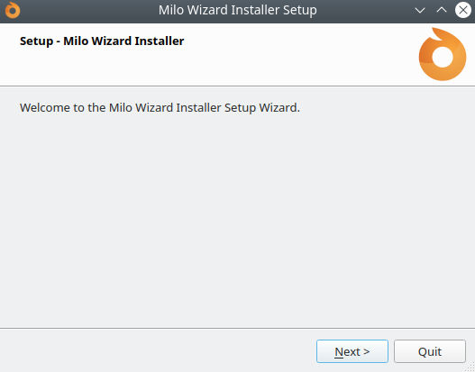
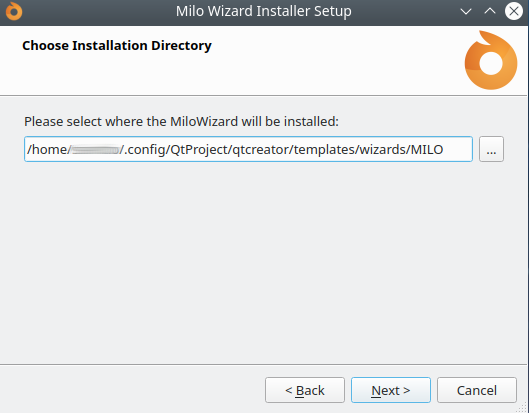
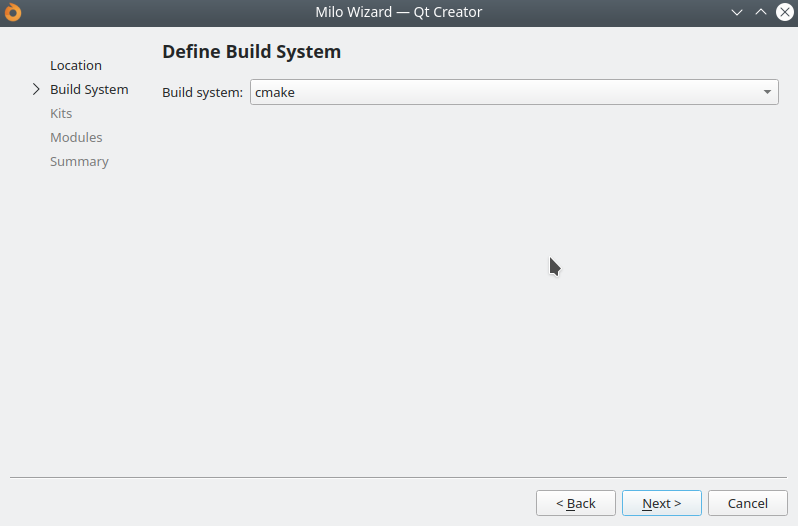

Milo QtCreator wizard
===

Source code: [GitHub](https://github.com/milosolutions)

\tableofcontents

# Intro

Milo Code Database is the place where we keep all useful pieces of code:
snippets, working modules, templates. The repository is organised into a Qt
Installer Framework project. MCDB is a great way to skip all the mundane and
boring code you have to write for each new project - here you get all the
initial project code prepared and ready for further development.

If you need some mobule for an existing project, see [subprojects](doc/subprojects.md). That page
also contains links to online documentation.

If you are creating a new project, you are encouraged to check our MCDB
installers. See the following sections for more details.

# Subprojects

Here is a list of subprojects (for github links click [here](doc/subprojects.md))
1. [New project template](https://docs.milosolutions.com/milo-code-db/mwizardtemplate) - template for all new Qt projects (QML and Widgets).
Contains a scaffolding for Qt app with documentation, tests, resources etc.
2. [MScripts](https://docs.milosolutions.com/milo-code-db/mscripts) - scripts for integration with GitLab CI, Mattermost, versioning
scripts for all platforms (including git SHA), and more
3. [MConfig](https://docs.milosolutions.com/milo-code-db/mconfig) - a small class which helps storing user app settings and configuration
4. [MLog](https://docs.milosolutions.com/milo-code-db/mlog) - small but powerful log class, with full categorized logging support
5. [MRestAPI](https://docs.milosolutions.com/milo-code-db/mrestapi) - handy set of base classes for talking with REST web servers
6. [MBarcodeScanner](https://docs.milosolutions.com/milo-code-db/mbarcodescanner) - small helper class that allows to scan barcodes and QR codes
using QZXing library
7. [MCharts](https://docs.milosolutions.com/milo-code-db/mcharts) - implements some simple yet meaningful and eye friendly charts to display data
8. [MSentry](https://docs.milosolutions.com/milo-code-db/msentry) - remote logger support (Sentry/ Raven). Easy to turn on and off, just with a config switch
9. [MCrypto](https://docs.milosolutions.com/milo-code-db/mcrypto) - AES module, containing simple and convenient API, based on OpenSSL and it has a fallback if OSSL is not available
10. [MSshTunnel](https://docs.milosolutions.com/milo-code-db/msshtunnel) - wraps ssh port forwarding functionality (a.k.a. SSH tunneling) with convinient class.
11. [MCalendar](https://docs.milosolutions.com/milo-code-db/mcalendar) - provides calendar widget
12. [MEmailSystem](https://docs.milosolutions.com/milo-code-db/memailsystem) - provides basic e-mail functionality.
13. [MDatabase](https://docs.milosolutions.com/milo-code-db/mdatabase) - provides database support and migrations functionality.

Instructions on how to add a new module are contained in [repositoryguide](doc/repositoryguide.md).

# QtCreator Wizard

You can find prebuilt installers of Milo QtCreator Wizard on our
[Seafile](https://seafile.milosolutions.com/d/2c50614e1e/).

The wizard is the quickest way to create a new project: with all
necessary boilerplate code in place. The .pro file, doxygen, logger, build
helpers, CI scripts, config classes... everything you choose to include
(the process is customizable) will be extracted to a single place - all
that is left for you is start coding the
interesting bits!

# Using MCDB

Milo Code DB can be used in 2 main ways:

1. Use the Milo QtCreator Wizard to set up a new project. Add any modules you will need.
2. Use MCDB modules in an existing project: either by copying the code or adding
them as git submodules.

Each MCDB submodule contains a readme file and doxygen documentation, so refer
to them for more info. All docs are also available
[online](https://git.milosolutions.com/milo-code-database/milo-qtcreator-wizard/blob/master/doc/subprojects.md).

## Starting from wizard

If you want to install MILO QtCreator Wizard, go to
[Seafile](https://seafile.milosolutions.com/d/2c50614e1e/) and download the
newest installer for your platform.

Run it (you may need to set the executable permission on Linux) and install it in default location.

If you have previous installation it will be updated.

At this point now you should be able to setup new project inside QtCreator (restart necessary!).

Creating new project involves several simple steps.

Choosing project location

Choosing build system (currenty only qmake is supported)

Choosing Kit

On the following screen you get to choose the Milo Code Database modules you
want to use in your project. All modules will be automatically added to your
.pro file - after installation the project will be ready to be used, either
with raw qmake or with Qt Creator.

If you select "Add to version control", the wizard will initialize repository for you.
All version control options are  optional.

When the wizard work is done, QtCreator will open the .pro file 
You can start coding at this point!. See the README.md located in your newly installed project for further
instructions.

## Platforms
Template wizard supports several platforms. If you want some additional features related to them simply check your platform in wizard (section above modules to choose)
### Android
### Mac
Norarization is now supported. For more details check 'macos_build' in .gitlab-ci.yml file insade your generated project.
### Linux
System will try to detect your distribution and automatically craete deb or rpm package. To disable this use 'no-deploy' flag. 
You can also create for example rpm package on debian related systems. To do so simply add rmpize to your config 
and make sure you have needed tools (rpmbuild from rpm package).
### Windows

## Using in existing project

You can also easily add MCDB modules to an existing Qt project. All that is
required is to:

1. Get the module source code (either copy it, or include as git submodule).
2. Add the module's .pri file to your main .pro.
3. You're ready!

# Developing MCDB

## Cloning git repository

*This info is useful for Milo employees only*

Clone this repository (milo-qtcreator-wizard) using either [Milo](https://git.milosolutions.com/milo-code-database/milo-qtcreator-wizard) repo or public
[GitHub](https://github.com/milosolutions/milo-qtcreator-wizard) repository.

Then checkout submodules manually or use `scripts/git_setup.sh`. Once you have
some committed changes, you can use `scripts/git_push.sh` to push all submodules
to both repositories.

## Building installer

Instructions for building Milo Wizard installer are listed
[here](doc/buildinginstaller.md).

## Requirements for new modules

Each separate piece of technology we share should be kept in a separate git
repository, and imported to DB using git submodule add. Milo Code Database
is only acting as a "home" to them all (mcdb-installer repository).

All code has to be properly licensed, documented, contain readme and doxygen
docs. More information about adding new modules is available in
[Repository guide](doc/repositoryguide.md).

# License

This project is licensed under the MIT License - see the LICENSE-MiloCodeDB.txt
file for details

# Further reading 

Checkout instructions are contained in [Repository guide](doc/repositoryguide.md).
This document also contains hints on how to efficiently (and correctly) use this
meta-repository and all submodules.
